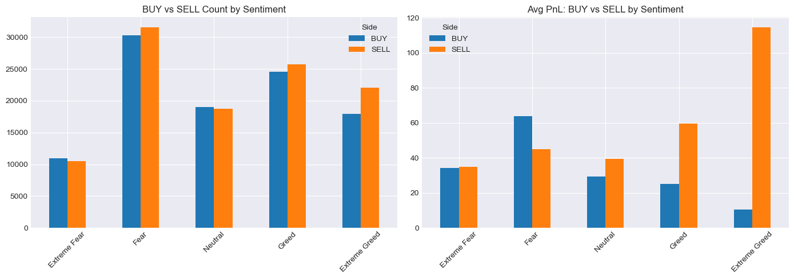
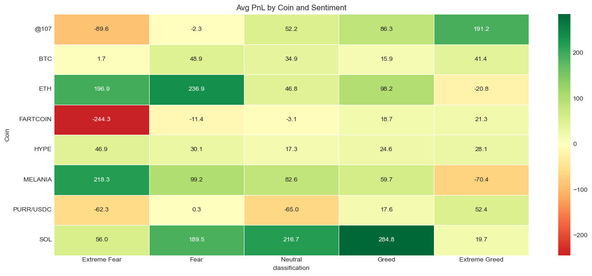
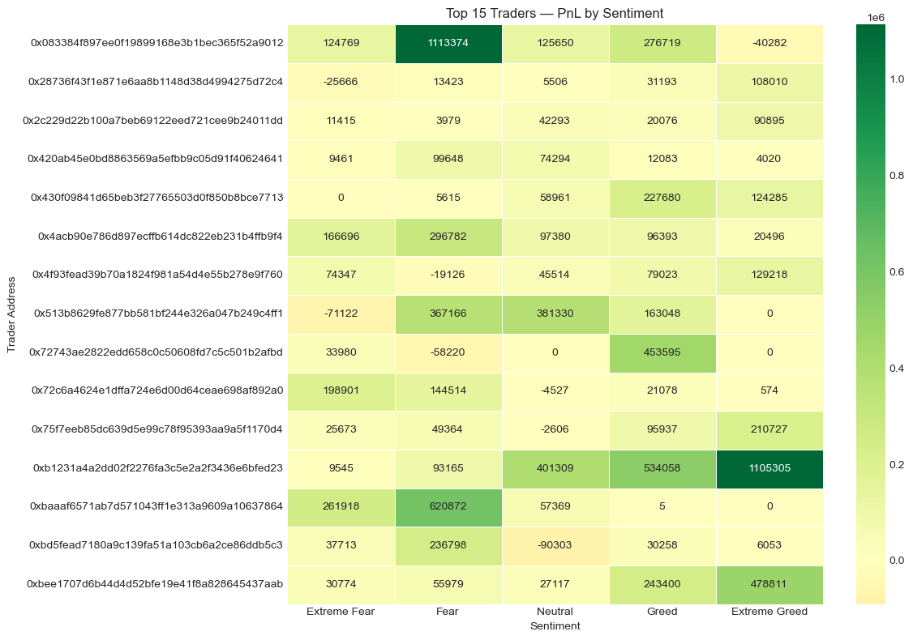
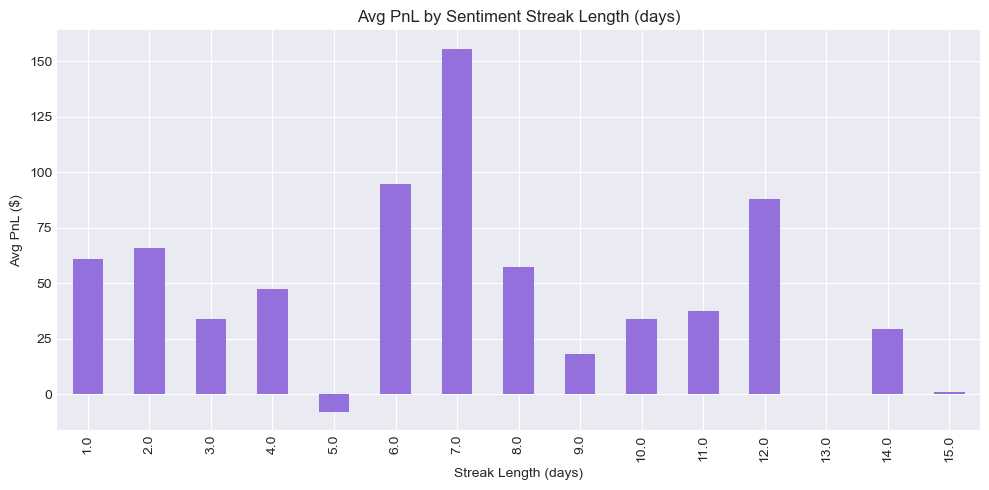
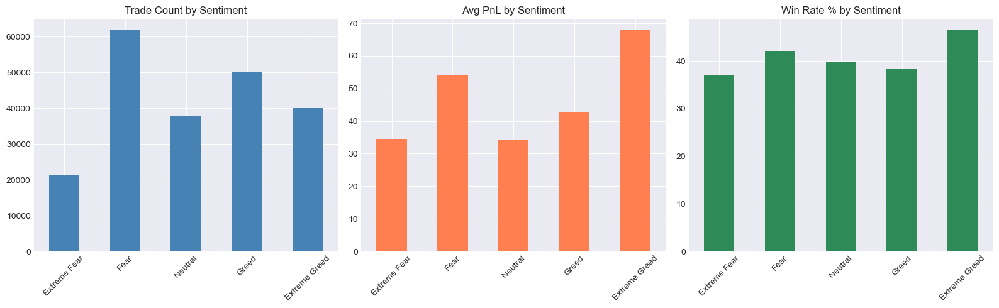

# Crypto_Sentiment_Trader_Analysis

> Analyzing how Bitcoin market sentiment (Fear & Greed) influences trader behavior and profitability on Hyperliquid — across 211K trades, 32 wallets, and 2 years of on-chain data.

---

## Problem Statement

Does market sentiment measurably affect trading outcomes? This analysis tests whether traders on Hyperliquid perform differently during periods of Fear vs Greed — and whether sentiment can be used as a signal to time entries, exits, and asset selection.

---

## Hypotheses

| # | Hypothesis | Result |
|---|---|---|
| H1 | Traders perform better during Greed than Fear | Partially true — Extreme Greed has highest avg PnL, but driven by SELL side |
| H2 | Buying during Extreme Fear is a contrarian edge | Partially supported (low consistency) — 20.2% win rate, low conviction signal |
| H3 | Consistent high win-rate traders are rare | Confirmed — only 3 of 32 traders exceed 50% win rate |
| H4 | Sentiment streak length affects trade outcomes | 7-day streaks produce peak avg PnL of $155.76 |
| H5 | Coin sensitivity to sentiment varies significantly | ETH thrives on Fear, SOL on Greed, FARTCOIN bleeds on Extreme Fear |

---

## Dataset
| | |
|---|---|
| **Trades** | 211,224 |
| **Traders** | 32 unique wallets |
| **Coins** | 246 |
| **Period** | May 2023 — May 2025 |
| **Sources** | Hyperliquid historical data + Bitcoin Fear/Greed Index |

---

## Key Findings

### Overall Performance
- **Total Realized PnL:** $10,296,958
- **Overall Win Rate:** 41.1%
- The low win rate vs high total PnL reveals an **asymmetric strategy** — traders win rarely but win big

---

### Sentiment vs Performance

| Sentiment | Trades | Avg PnL | Win Rate |
|---|---|---|---|
| Extreme Fear | 21,400 | $34.54 | 37.1% |
| Fear | 61,837 | $54.29 | 42.1% |
| Neutral | 37,686 | $34.31 | 39.7% |
| Greed | 50,303 | $42.74 | 38.5% |
| **Extreme Greed** | 39,992 | **$67.89** | **46.5%** |

> **Extreme Greed** shows the highest avg PnL — but this is driven almost entirely by the **SELL side ($114.58 avg)**, not buying. Traders who close longs and short into euphoria capture the bulk of profits during this regime.

---

###  BUY vs SELL by Sentiment

- SELL trades during Extreme Greed average **$114.58 PnL** — the strongest signal in the entire dataset
- BUY during Extreme Greed averages only **$10.50** — chasing euphoria is the worst entry
- Traders instinctively close longs and short into rallies

---

###  Trader Leaderboard

| Rank | Address | Total PnL | Win Rate | Style |
|---|---|---|---|---|
| 1 | 0xb123...ed23 | $2,143,382 | 34% | Momentum |
| 2 | 0x0833...9012 | $1,600,229 | 36% | Contrarian |
| 3 | 0xbaaa...7864 | $940,163 | 47% | Mixed |
| ✦ | 0x75f7...70d4 | $379,095 | **81%** | Smart Money |
| ✦ | 0x2c22...11dd | $168,658 | 52% | Smart Money |

> ✦ Smart Money = win rate ≥ 50% with 50+ trades. Only **3 out of 32 traders** qualify.

---

### Sentiment Streak Effect

- After **7 consecutive days** of the same sentiment, avg PnL spikes to **$155.76**
- Market conviction builds over a week — day 7 of a streak is a reliable entry signal
- Day 5 streaks go negative — a dip before the breakout

---

###  Coin Performance by Sentiment

| Coin | Best Sentiment | Avg PnL | Worst Sentiment |
|---|---|---|---|
| ETH | Fear | $236.9 | Extreme Greed (-$20.8) |
| SOL | Greed | $284.8 | Extreme Fear (+$56) |
| MELANIA | Extreme Fear | $218.3 | Extreme Greed (-$70.4) |
| BTC | Fear | $48.9 | Stable across all |
| FARTCOIN | — | — | Extreme Fear (-$244.3 |

---

## Strategy Signals

> These signals are derived from aggregate patterns across 2 years of data. They are directional rules, not guarantees — position sizing and risk management still apply.

| Signal | Avg PnL | Win Rate | Rule |
|---|---|---|---|
| Buy on Extreme Fear | $34.11 | 20.2% | Small size only — low hit rate, occasional large payoff |
| Buy on Extreme Greed | $10.50 | 31.1% |  Avoid — worst risk/reward setup in the dataset |
| **Sell / Short on Extreme Greed** | **$114.58** | — | Primary edge — close longs, consider shorts |
| **Enter on Day 7 of a Streak** | **$155.76** | — | Timing filter — wait for sentiment conviction to build |
| Trade ETH/MELANIA on Fear days | $196–237 | — | Sentiment-specific asset rotation |
| Trade SOL on Greed days | $284.8 | — | Momentum asset, thrives in risk-on conditions |

---

## Limitations

- **32 traders is a small sample** — patterns may not generalize to the broader Hyperliquid user base
- **Closed PnL only** — open/unrealized positions are excluded; some trader performance may be understated or overstated
- **Correlation ≠ causation** — sentiment co-occurs with price action; it's hard to isolate sentiment as the independent variable
- **Streak analysis is exploratory** — the 7-day signal has limited data points at higher streak lengths and needs forward testing
- **No leverage normalization** — high PnL traders may simply be using more leverage, not better strategy

---

## Tools Used

| Tool | Purpose |
|---|---|
| Python + Pandas + NumPy | Data cleaning, merging, feature engineering |
| Matplotlib + Seaborn | Visualizations and heatmaps |
| Jupyter Notebook | Analysis environment |

---

*Submitted as part of PrimeTrade.ai Data Science hiring assignment — April 2026*
